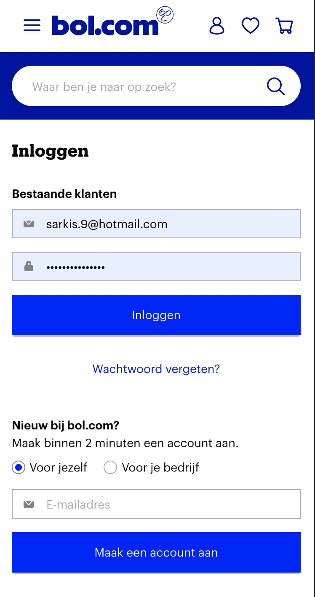
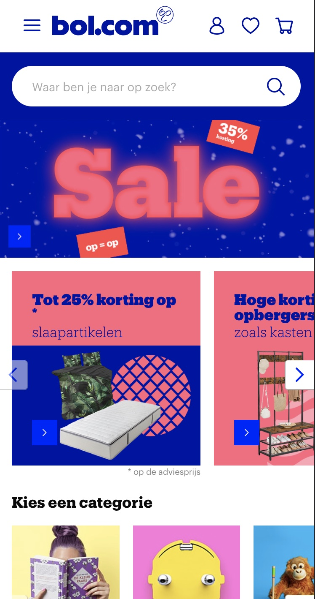
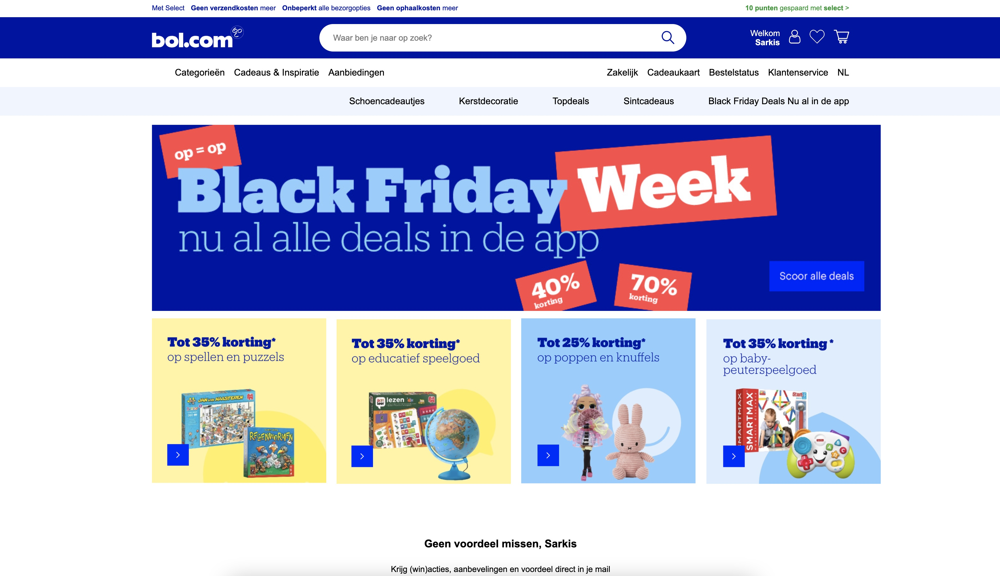
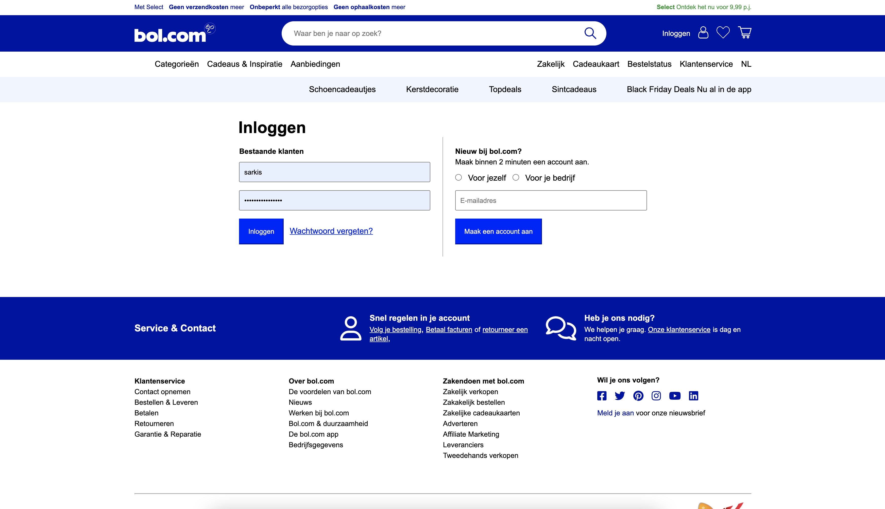
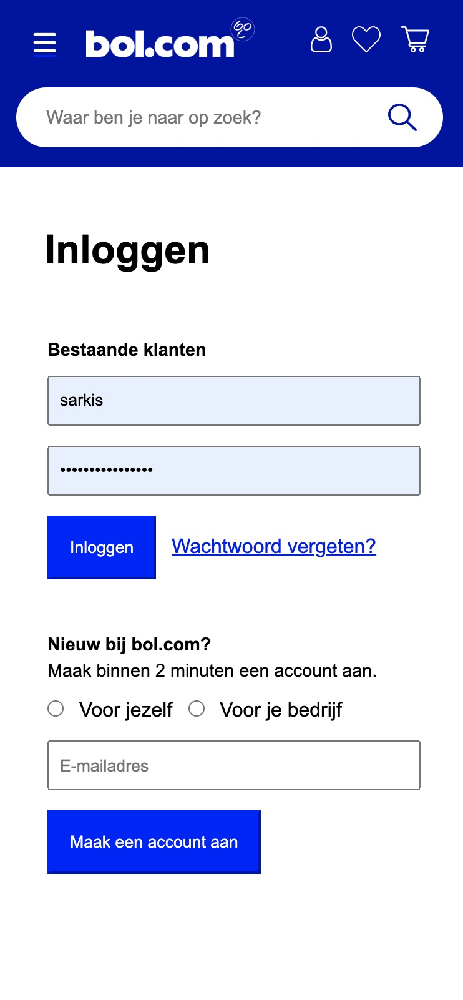
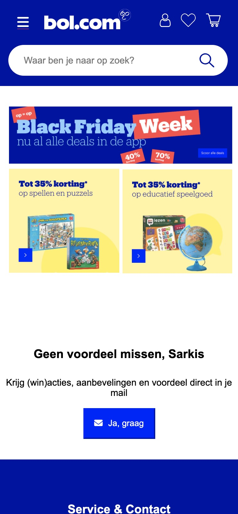
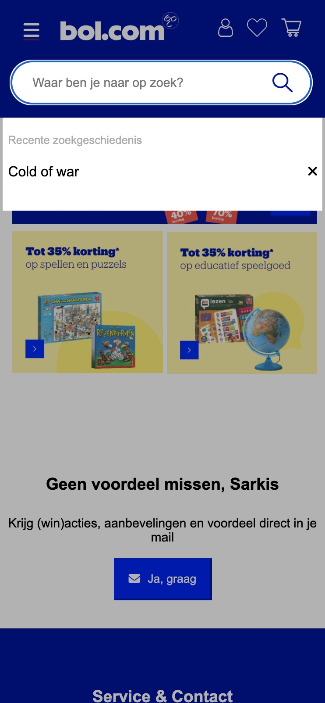
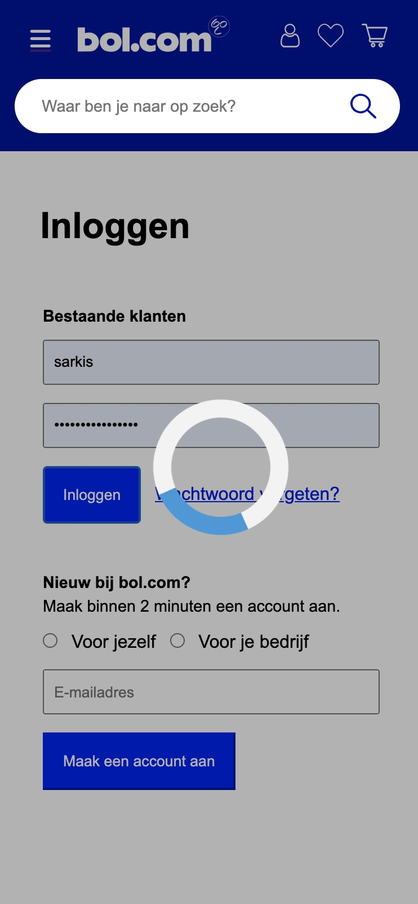

## Je website

 
### Je opdracht:
www.bol.com

#### Screenshot(s) van de eerste pagina (small screen): 
Home pagina

#### Screenshot(s) van de tweede pagina (small screen):
Login pagina 

 

## Toegankelijkheidstest

### Bevindingen

#### Headingstructuur
Headings door elkaar

Dit kan opgelost worden door de headingtags aan te passen van groot naar klein

#### tab-toets navigeren
Navigeren met de tab-toets gaat prima, echter zijn er enkele elementen die die niet geselecteerd worden.

 Dit komt voor bij afbeeldingen zonder link. Er kan een  tag toegevoegd worden om dit op te lossen.

#### Afbeeldingen met button
Afbeeldingen met button zijn op sommige plekken screenshots.

De screenshots vervangen voor 2 losse elementen. Een afbeelding en een button.

## Eindgesprek

### Stand van zaken
Het schrijven van de code ging overall prima. Geen moeite met html/css of js. Het enige waar ik tegenaanliep was de het responsive maken. Ik heb daar vooraf geen rekening meegehouden. Ik ben begonnen met de desktop versie helemaal uitwerken alvorens ik media-queries invoegde. Hierdoor heb ik ook geen rekening gehouden met de HTML structuur voor mobiel. Dit heb ik veelal opgelost door css grid. Door middel van elementen weg te laten en van plek te wisselen heb ik dit kunnen oplossen.

### Screenshot(s)
 

## Bronnenlijst

1. https://stackoverflow.com/questions/70339367/flexbox-align-items-and-justify-content-end-not-working-in-safari-macos/70353439
2. https://fontawesome.com/v5.15/icons?d=gallery&p=2&m=free
3. https://cdnjs.com/libraries/font-awesome
4. https://dlo.mijnhva.nl/d2l/le/content/392709/Home

